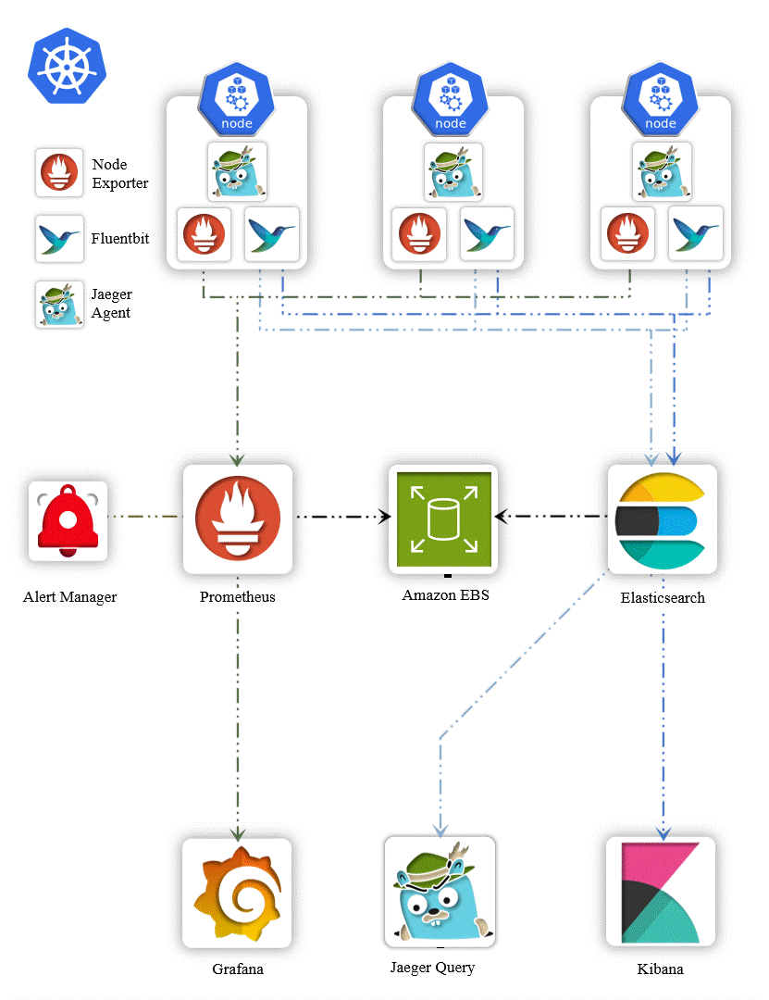

# Monitoring

## Metrics vs Monitoring
Metrics are measurements or data points that tell you what is happening. For example, the number of steps you walk each day, your heart rate, or the temperature outside—these are all metrics.

Monitoring is the process of watching these metrics over time to understand what’s normal, spot changes, and detect problems.

## 🚀 Prometheus Overview
Prometheus is an open-source system for monitoring and sending alerts. It collects and stores time-series data (data that changes over time) using its own database. It can be used in various environments, including Kubernetes.

### Prometheus Architecture
Here's a simple view of how Prometheus works:


- **Prometheus Server**: The main component that collects (scrapes) metrics and stores them.
- **Service Discovery**: Automatically finds services and applications to monitor.
- **Pushgateway**: Allows short-lived jobs to push metrics.
- **Alertmanager**: Manages alerts and sends notifications via email, Slack, or PagerDuty.
- **Exporters**: Collects metrics from external systems and makes them available to Prometheus.
- **Grafana**: Visualizes the collected metrics.

## 🛠️ Installation & Configuration

### Step 1: Create GKE Cluster
Make sure you have a GKE cluster up and running.

### Step 2: Install kube-prometheus-stack
```bash
helm repo add prometheus-community https://prometheus-community.github.io/helm-charts
helm repo update
```

### Step 3: Deploy into a Namespace
```bash
kubectl create ns monitoring
```
```bash
cd observability-zero-to-hero
```
```bash
cd day-2
helm install monitoring prometheus-community/kube-prometheus-stack -n monitoring -f ./custom_kube_prometheus_stack.yml
```

### Step 4: Verify Installation
```bash
kubectl get all -n monitoring
```

## 📍 Step 5: Access Prometheus, Grafana, and Alertmanager
Create LoadBalancer services using the following YAML:

```yaml
apiVersion: v1
kind: Service
metadata:
  name: prometheus-loadbalancer
  namespace: monitoring
spec:
  type: LoadBalancer
  ports:
  - port: 9090
    targetPort: 9090
    protocol: TCP
  selector:
    app.kubernetes.io/name: prometheus
---
apiVersion: v1
kind: Service
metadata:
  name: grafana-loadbalancer
  namespace: monitoring
spec:
  type: LoadBalancer
  ports:
  - port: 80
    targetPort: 3000
    protocol: TCP
  selector:
    app.kubernetes.io/name: grafana
---
apiVersion: v1
kind: Service
metadata:
  name: alertmanager-loadbalancer
  namespace: monitoring
spec:
  type: LoadBalancer
  ports:
  - port: 9093
    targetPort: 9093
    protocol: TCP
  selector:
    app.kubernetes.io/name: alertmanager
```

Apply the services:
```bash
kubectl apply -f loadbalancer_services.yaml
```

Get the External IPs:
```bash
kubectl get svc -n monitoring
```
- **Prometheus**: `http://<EXTERNAL_IP_PROMETHEUS>:9090`
- **Grafana**: `http://<EXTERNAL_IP_GRAFANA>` (Password: `prom-operator`)
- **Alertmanager**: `http://<EXTERNAL_IP_ALERTMANAGER>:9093`

## 🧼 Step 6: Clean Up
Uninstall helm chart:
```bash
helm uninstall monitoring --namespace monitoring
```
Delete namespace:
```bash
kubectl delete ns monitoring
```
Delete GKE Cluster:
```bash
gcloud container clusters delete observability --region=us-central1
```
---

# 📊 Prometheus Metrics & Monitoring

## 📌 Overview
Prometheus is a **powerful tool** that helps you **monitor and analyze** system performance. It collects data over time and lets you check how your system is doing.

---

## 🏷️ What are Metrics & Labels?

### **📌 Metrics**
Metrics are **data points** that show important information about your system, like **CPU usage, memory usage, and network activity**.

### **🏷️ Labels**
Labels are **extra details** that help organize metrics. They are like **tags** that tell you more about where the data comes from.

🔍 **Example:**
```promql
container_cpu_usage_seconds_total{namespace="kube-system", endpoint="https-metrics"}
```
- `container_cpu_usage_seconds_total` → This is the metric (it tracks CPU usage)
- `{namespace="kube-system", endpoint="https-metrics"}` → These are the labels (they give more details about where the data is coming from)

---

## 🔍 What is PromQL?
PromQL (**Prometheus Query Language**) is a special language used to **search, analyze, and work with Prometheus data**.

### **🔑 What Can PromQL Do?**
✅ **Find specific data** – You can filter data based on conditions.
✅ **Do math on data** – You can add, subtract, and compare numbers.
✅ **Group data together** – You can see totals, averages, and trends.
✅ **Use functions** – You can transform data into useful insights.

---

## 💡 Basic PromQL Examples

### **📌 Get CPU Usage Data**
```promql
container_cpu_usage_seconds_total
```
🔹 This shows CPU usage data for all containers.

```promql
container_cpu_usage_seconds_total{namespace="kube-system",pod=~"kube-proxy.*"}
```
🔹 This filters the data to show only CPU usage from specific pods.

```promql
container_cpu_usage_seconds_total{namespace="kube-system",pod=~"kube-proxy.*"}[5m]
```
🔹 This gets CPU usage over the last **5 minutes**.

---

## ⚙️ Combining Data with PromQL

### **📌 Total CPU Usage on All Nodes**
```promql
sum(rate(node_cpu_seconds_total[5m]))
```
🔹 Adds up CPU usage across all nodes.

### **📌 Average Memory Usage per Namespace**
```promql
avg(container_memory_usage_bytes) by (namespace)
```
🔹 Shows the average memory usage for each namespace.

### **📌 Check How Fast CPU Usage is Changing**
```promql
rate(container_cpu_usage_seconds_total[5m])
```
🔹 Finds out how quickly CPU usage is changing over 5 minutes.

### **📌 Count How Many Times a Container Restarted**
```promql
increase(kube_pod_container_status_restarts_total[1h])
```
🔹 Shows how many times containers restarted in the last hour.

### **📌 Check API Request Time (95th Percentile)**
```promql
histogram_quantile(0.95, sum(rate(apiserver_request_duration_seconds_bucket[5m])) by (le))
```
🔹 Tells you how long most API requests are taking.

---

## 🚀 How to Use This Repository

1️⃣ **Download the Repository**
```bash
git clone https://github.com/your-repo-name.git
```

2️⃣ **Install Prometheus in Kubernetes (Using Helm)**
```bash
helm repo add prometheus-community https://prometheus-community.github.io/helm-charts
helm install prometheus prometheus-community/kube-prometheus-stack -n monitoring
```

3️⃣ **Open the Prometheus Dashboard**
```bash
kubectl port-forward -n monitoring svc/prometheus-kube-prometheus-prometheus 9090:9090
```
🔹 Now, go to **http://localhost:9090** in your web browser.

4️⃣ **Run Queries in PromQL** to Monitor Your System.

---

# Instrumentation

Instrumentation means adding monitoring to applications, systems, or services. This helps track how well they are performing by collecting data like logs, metrics, and traces.

## Why Use Instrumentation?
- **Better Visibility**: Understand what is happening inside your applications and systems.
- **Metrics Collection**: Track important details like CPU usage, memory, request rates, and errors.
- **Easier Troubleshooting**: Find and fix problems quickly using the collected data.

## How It Works
- **Code-Level Instrumentation**: Add monitoring directly in your code. For example, in a Node.js application, you can use `prom-client` to collect custom metrics.

## Prometheus and Instrumentation
- **Exporters**: These collect metrics from different systems and format them for Prometheus.
    - **Node Exporter**: Collects system-level data from Linux/Unix.
    - **MySQL Exporter**: Collects MySQL database metrics.
    - **PostgreSQL Exporter**: Collects PostgreSQL database metrics.
- **Custom Metrics**: You can add your own application-specific metrics, such as tracking user logins.

## Types of Metrics in Prometheus
- **Counter** (Always Increases):
  - Example: Counting the number of container restarts.
  - Example Metric: `kube_pod_container_status_restarts_total`
- **Gauge** (Goes Up and Down):
  - Example: Monitoring memory usage.
  - Example Metric: `container_memory_usage_bytes`
- **Histogram** (Samples Data in Buckets):
  - Example: Tracking API response times.
  - Example Metric: `apiserver_request_duration_seconds_bucket`
- **Summary** (Similar to Histogram, Includes Percentiles):
  - Example: Monitoring 95th percentile of request duration.
  - Example Metric: `apiserver_request_duration_seconds_sum`

# Project Goals
- **Custom Metrics in Node.js**: Use `prom-client` to add monitoring.
- **Set Up Alerts**: Use Alertmanager to send email notifications when a container restarts more than twice.
- **Logging**: Use the EFK stack (Elasticsearch, FluentBit, Kibana) to track logs.
- **Distributed Tracing**: Use Jaeger to trace requests across services.

# Architecture


## 1) Add Custom Metrics
- Look at `day-4/application/service-a/index.js` for details.
- **Express Setup**: Initializes an Express app.
- **Logging with Pino**: Uses Pino for structured logging.
- **Prometheus Metrics**:
    - `http_requests_total`: Counter
    - `http_request_duration_seconds`: Histogram
    - `http_request_duration_summary_seconds`: Summary
    - `node_gauge_example`: Gauge for async tasks
- **API Routes**:
  - `/` : App status
  - `/healthy`: Health check
  - `/serverError`: Simulate a 500 error
  - `/notFound`: Simulate a 404 error
  - `/logs`: Generate logs
  - `/crash`: Crash the app
  - `/example`: Async task monitoring
  - `/metrics`: Expose Prometheus metrics
  - `/call-service-b`: Call service B

## 2) Dockerize and Push to Registry
- Run these commands:
```bash
cd day-4

# Build service-a container
docker build -t <<REPO_NAME>>:<<TAG>> application/service-a/
# Example: abhishekf5/demoservice-a:v

# Build service-b container
docker build -t <<REPO_NAME>>:<<TAG>> application/service-b/
```
- Or use these pre-built images:
  - `abhishekf5/demoservice-a:v`
  - `abhishekf5/demoservice-b:v`

## 3) Deploy on Kubernetes
- Apply Kubernetes manifests:
```bash
kubectl create ns dev
kubectl apply -k kubernetes-manifest/
```

## 4) Test API Endpoints
- Open a browser and test the LoadBalancer DNS with these paths:
  - `/`
  - `/healthy`
  - `/serverError`
  - `/notFound`
  - `/logs`
  - `/example`
  - `/metrics`
  - `/call-service-b`
- Run automated test script:
```bash
./test.sh <<LOAD_BALANCER_DNS_NAME>>
```

## 5) Configure Alertmanager
- Look at `day-4/alerts-alertmanager-servicemonitor-manifest` for details.
- **Set up email alerts**:
  - Get an app password from Gmail.
  - Add it to `email-secret.yml`.
  - Put your email in `alertmanagerconfig.yml`.
- **Alert Rules**:
  - **High CPU Usage**: Warning if usage is over 50% for 5+ minutes.
  - **Pod Restart**: Alert if a pod restarts more than 2 times.
- Apply the configurations:
```bash
kubectl apply -k alerts-alertmanager-servicemonitor-manifest/
```
- Wait 4-5 minutes, then check Prometheus UI for metrics:
  - `http_requests_total`
  - `http_request_duration_seconds`
  - `http_request_duration_summary_seconds`
  - `node_gauge_example`

## 6) Test Alerts
- Manually crash the container more than twice:
```bash
<<LOAD_BALANCER_DNS_NAME>>/crash
```
- You should receive an email alert when the container restarts at least 3 times.


